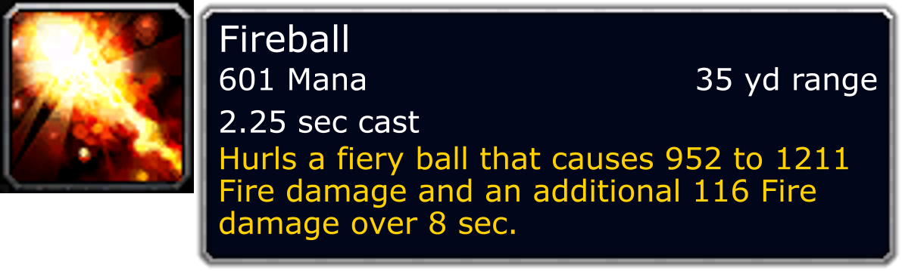

# Custom Tooltips

##### *This code can also be found in the ExampleProject.*

To make your own tooltips, you'll need to make what's known as an [ITooltipProvider][1].

We are going to be doing this to create a very basic provider for spells. For this example, we will re-create the Fireball spell.

### This is the example we will produce:

[](custom-tooltips/fireball.png)

## ISpell Interface
``` c#
public interface ISpell
{
    IGraphic GetIcon();
    string GetName();
    int GetResourceCost();
    string GetResource();
    /// <summary>
    /// In seconds
    /// </summary>
    decimal GetCastTime();
    /// <summary>
    /// In yards
    /// </summary>
    int GetRange();
    string GetDescription();
}
```

## ISpell implementation class, Spell
``` c#
public class Spell : ISpell
{
    #region Properties
    public IGraphic Icon { get; set; }
    public string Name { get; set; }
    public int ResourceCost { get; set; }
    public string Resource { get; set; }
    /// <summary>
    /// In yards
    /// </summary>
    public int Range { get; set; }
    /// <summary>
    ///  In seconds
    /// </summary>
    public decimal CastTime { get; set; }
    public string Description { get; set; }
    #endregion
    #region ISpell Accessors
    public IGraphic GetIcon() => Icon;
    public string GetName() => Name;
    public int GetResourceCost() => ResourceCost;
    public string GetResource() => Resource;
    public int GetRange() => Range;
    public decimal GetCastTime() => CastTime;
    public string GetDescription() => Description;
    #endregion
}
```

## SpellTooltipProvider
``` c#
public class SpellTooltipProvider : ITooltipProvider<ISpell>
{
    public bool DrawIcon { get; set; } = true;

    public bool ShouldDrawIcon(ISpell spell) => DrawIcon;
    public Image<Rgba32> GetIcon(ISpell spell) => spell.GetIcon().GetImage();

    public TooltipText GetTitle(ISpell spell) => new TooltipText(spell.GetName(), TooltipColors.White);
    public IEnumerable<ITooltipSection> GetSections(ISpell spell)
    {
        var sections = new List<ITooltipSection>();

        var section = new TooltipSection();

        var resource = $"{spell.GetResourceCost()} {spell.GetResource()}";
        var range = $"{spell.GetRange()} yd range";
        var castTime = $"{spell.GetCastTime().ToString("N2")} sec cast";

        section.Lines.Add(new LeftText(resource) + new RightText(range));
        section.Lines.Add(new LeftText(castTime));
        section.Lines.Add(new ParagraphLine(new TooltipText(spell.GetDescription(), TooltipColors.Flavor)));

        sections.Add(section);

        return sections;
    }
}
```

## Example using the above code
---

## Creating the spell:
``` c#
var drawIcon = true;
var spell = new Spell();

spell.Name = "Fireball";
spell.ResourceCost = 601;
spell.Resource = "Mana";
spell.Range = 35;
spell.CastTime = 2.25M;

spell.Description = "Hurls a fiery ball that causes 952 to 1211 Fire damage and an additional 116 Fire damage over 8 sec.";

if (withIcon)
{
    // This should be the PNG export location with '/Interface/ICONS' appended to the end.
    string iconDirectory = null;
    var iconGen = new GraphicFileGenerator(iconDirectory);
    spell.Icon = iconGen.FindSpecific("spell_fire_flamebolt");
}
```
## Generating the tooltip
The below code expects a static class called `TooltipGenerators` which resolves the appropriate TooltipGenerator to use.

In the event that you do not have this set up, or you need to set up some sort of a TooltipGenerator, please check out the guide on [setting up TooltipGenerators][1].

``` c#
var generator = TooltipGenerators.DefaultGenerator;
// Creates the TooltipProvider for spells.
var provider = new SpellTooltipProvider { DrawIcon = drawIcon };

// Generates the tooltip!
var scale = 4f;
var tooltip = generator.Generate(provider, fireball, scale);
using var file = File.Open("tooltip.png", FileMode.Create);
tooltip.SaveAsPng(file);
```

[1]:../Tooltips/Interface/ITooltipProvider.cs