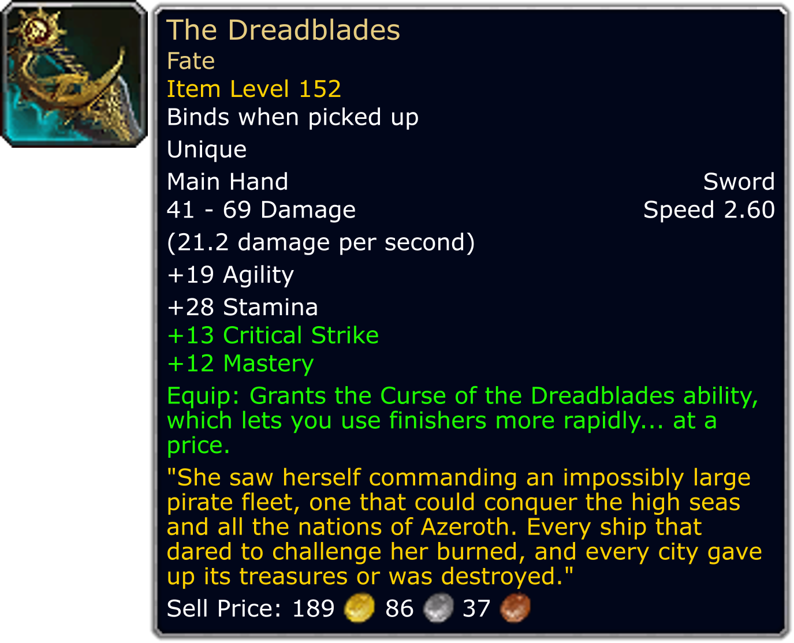
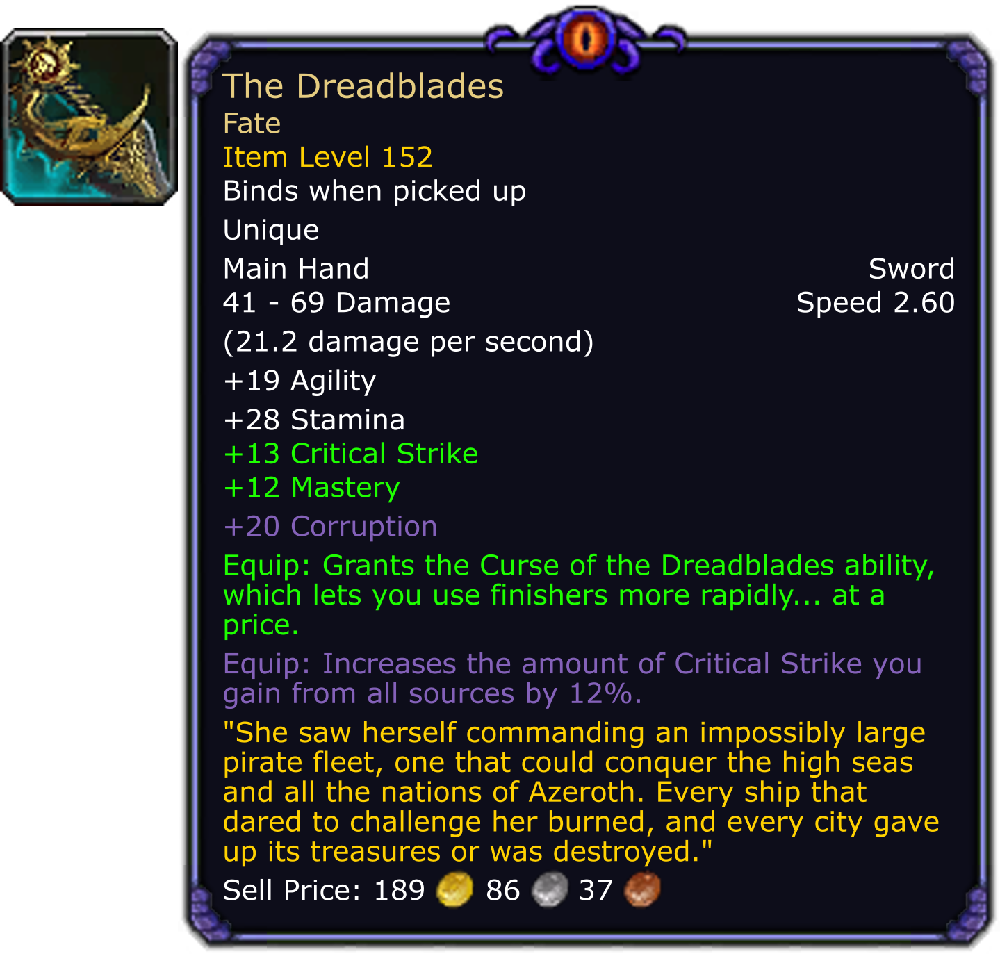

# Generating custom items and their tooltips

##### *This code can also be found in the ExampleProject.*

The below code will replicate this item: https://www.wowhead.com/item=128872

### This is the examples we will produce:

[](item-tooltips/fate-1.png)
[](item-tooltips/fate-2.png)

## Generating the item:
``` c#
var withIcon = true;
var item = new Weapon();

item.Name = "The Dreadblades";
item.Rarity = ItemRarity.Artifact;
item.MultiPieceName = "Fate";
item.ItemLevel = new ItemLevel(152);
item.BindsOn = "Binds when picked up";
item.Uniqueness = "Unique";
item.Type = new EquipmentType.Weapon("Main Hand", "Sword");
item.MinimumDamage = 41;
item.MaximumDamage = 69;
item.AttackSpeed = 2.6M;
item.Stats.Add(new WoWStat(StatType.Primary, "Agility", 19));
item.Stats.Add(new WoWStat(StatType.Primary, "Stamina", 28));
item.Stats.Add(new WoWStat(StatType.Secondary, "Critical Strike", 13));
item.Stats.Add(new WoWStat(StatType.Secondary, "Mastery", 12));

if (withIcon)
{
    // This should be the PNG export location with '/Interface/ICONS' appended to the end.
    string iconDirectory = null;
    var iconGen = new GraphicFileGenerator(iconDirectory);
    item.Icon = iconGen.FindSpecific("inv_sword_1h_artifactskywall_d_01");
}

// can't add relic slots or class restrictions

item.EquipEffects.Add(new EquipEffect("Grants the Curse of the Dreadblades ability, which lets you use finishers more rapidly... at a price."));

item.Flavor = "She saw herself commanding an impossibly large pirate fleet, one that could conquer the high seas and all the nations of Azeroth. Every ship that dared to challenge her burned, and every city gave up its treasures or was destroyed.";

item.SellPrice.SetAmount(1898637);
```

## Fancy some corruption?
``` c#
item.Stats.Add(new WoWStat(StatType.Corruption, "Corruption", 20));
item.EquipEffects.Add(new EquipEffect("Increases the amount of Critical Strike you gain from all sources by 12%.").Corrupt());
```

## Generating the tooltip
The below code expects a static class called `TooltipGenerators` which resolves the appropriate TooltipGenerator to use.

In the event that you do not have this set up, or you need to set up some sort of a TooltipGenerator, please check out the guide on [setting up TooltipGenerators][1].

``` c#
var generator = TooltipGenerators.Resolve(item);
// Creates the TooltipProvider for items.
var provider = new ItemTooltipProvider { DrawIcon = drawIcon };

// Generates the tooltip!
var scale = 4f;
var tooltip = generator.Generate(provider, item, scale);

// Saves the tooltip as an image with the name "tooltip.png".
using var file = File.Open("tooltip.png", FileMode.Create);
tooltip.SaveAsPng(file);
```


[1]:item-tooltip-generators.md